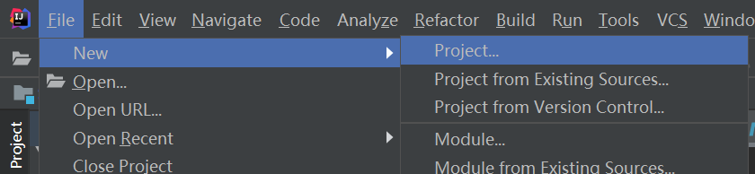
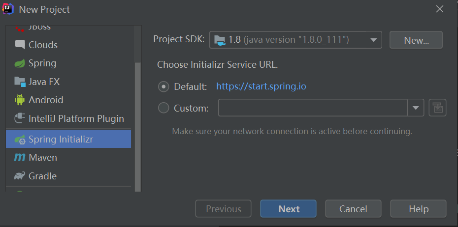
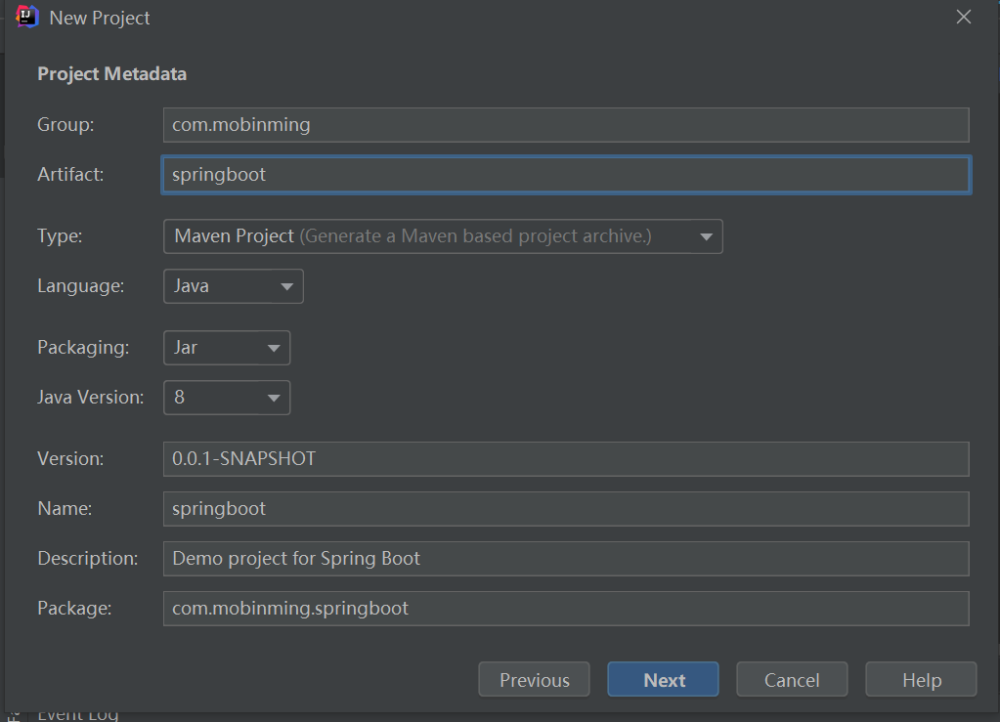
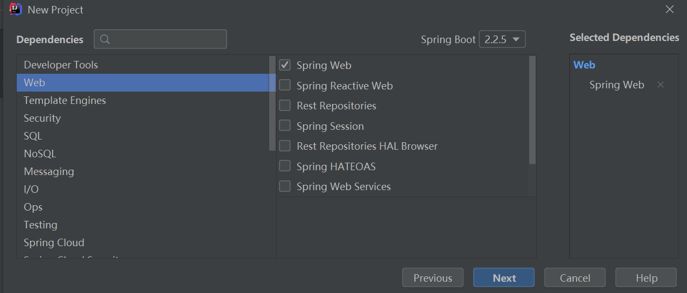
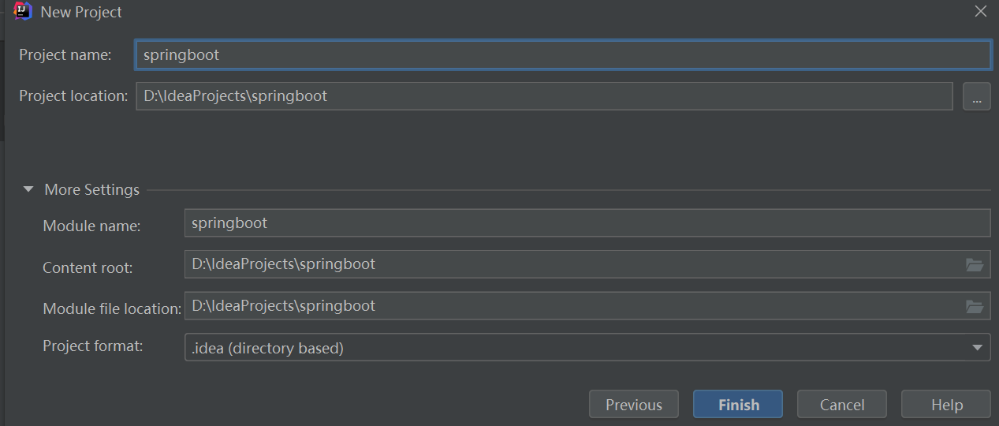
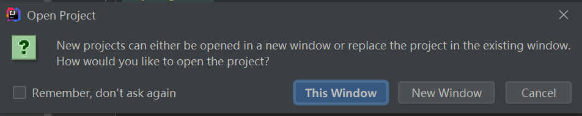
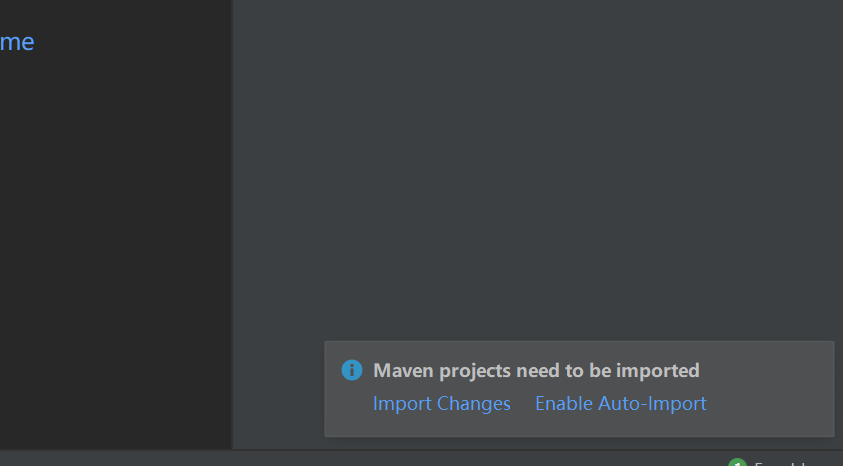

# idea SpringBoot实例
使用Mybatis-Plus生成代码
****
## 目录
* [使用SpringInitializr创建SpringBoot项目](#使用SpringInitializr创建SpringBoot项目) 
* [使用Mybatis-Plus生成代码](#使用Mybatis-Plus生成代码) 
****
### 使用SpringInitializr创建SpringBoot项目
------
#### 1、File→New→Project 



#### 2、选择Spring Initializr，选择JDK版本→Next  



#### 3、填写项目名称，java版本，其他描述信息→Next     



#### 4、选择web依赖→Next   



#### 5、选择项目存放路径→Fiinsh



#### 6、This Window在当前打开项目，New Window新开窗口打开项目，选其一



#### 7、右下角弹出窗口选着Enable Auto-import自动引入依赖，进度条加载完成SpringBoot项目的创建



****
### 使用Mybatis-Plus生成代码
------

#### 1、 引入依赖  
```xml
        <!--添加mysql依赖-->
        <dependency>
            <groupId>mysql</groupId>
            <artifactId>mysql-connector-java</artifactId>
            <version>5.1.48</version>
        </dependency>
        <!--添加mybatis-plus依赖-->
        <dependency>
            <groupId>com.baomidou</groupId>
            <artifactId>mybatis-plus-boot-starter</artifactId>
            <version>3.3.1.tmp</version>
        </dependency>
        <dependency>
            <groupId>org.projectlombok</groupId>
            <artifactId>lombok</artifactId>
            <version>1.18.12</version>
        </dependency>
```

#### 2、 编辑application.yml
```yaml

```