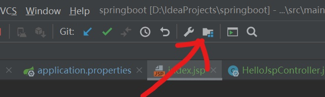

# idea SpringBoot实例
#使用SpringInitializr创建SpringBoot项目
****
## 目录
* [使用SpringInitializr创建SpringBoot项目](#使用SpringInitializr创建SpringBoot项目) 
* [使用JSP模板](#使用JSP模板) 
****
使用SpringInitializr创建SpringBoot项目
------
1、File→New→Project 


2、选择Spring Initializr，选择JDK版本→Next  


3、填写项目名称，java版本，其他描述信息→Next     


4、选择web依赖→Next   


5、选择项目存放路径→Fiinsh


6、This Window在当前打开项目，New Window新开窗口打开项目，选其一


7、右下角弹出窗口选着Enable Auto-import自动引入依赖，进度条加载完成SpringBoot项目的创建


****
使用JSP模板
------
1、 在pom.xm中加入支持JSP的依赖
```xml
           <dependency>
               <groupId>org.apache.tomcat.embed</groupId>
               <artifactId>tomcat-embed-jasper</artifactId>
               <scope>provided</scope>
           </dependency>
           <dependency>
               <groupId>javax.servlet.jsp.jstl</groupId>
               <artifactId>jstl-api</artifactId>
               <version>1.2</version>
           </dependency>
```
2、 在src/main/resources/application.properties文件中配置JSP和传统Spring MVC中和view的关联
```properties
# MVC
spring.mvc.view.prefix=/WEB-INF/views/
spring.mvc.view.suffix=.jsp
```
3、添加webapp目录

​	3.1、创建src/main/webapp/WEB-INF/views目录，新建index.jsp文件就放这里

```jsp
<%@ page contentType="text/html;charset=UTF-8" language="java" %>
<html>
<head>
    <title>Hello JSP</title>
</head>
<body>
Hello ${name}
</body>
</html>
```
​	3.2、设置Web模板的位置  

​    3.2.1、点击IDEA右上角的Project Structure

  
​    3.2.2、修改如图两处地方，先修改Path路径（点击上图中path框右边的小铅笔图标即可编辑），再修改Web Resource Directory


4、包名下新建controller包   


控制器类HelloJspController：

```java
import org.springframework.boot.autoconfigure.EnableAutoConfiguration;
import org.springframework.stereotype.Controller;
import org.springframework.web.bind.annotation.RequestMapping;
import javax.servlet.http.HttpServletRequest;

@Controller
@EnableAutoConfiguration
public class HelloJspController{
    @RequestMapping("/")
    public String getListaUtentiView(HttpServletRequest request){
        request.setAttribute("name", "我是/webapp/WEB-INF/views/index.jsp");
        return "index";
    }
}
```

