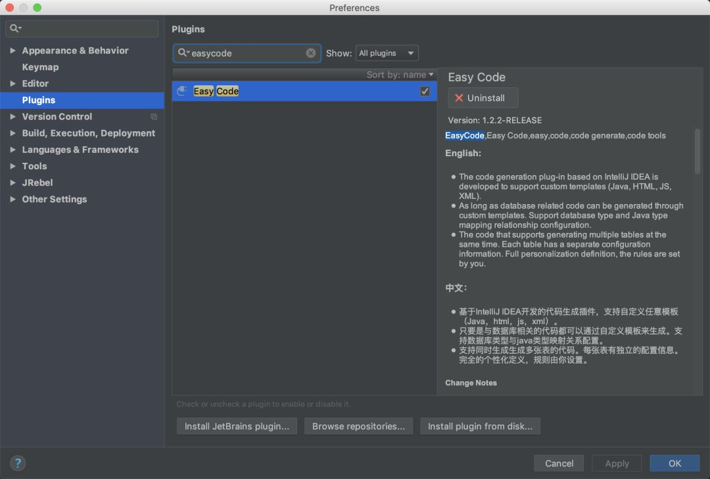
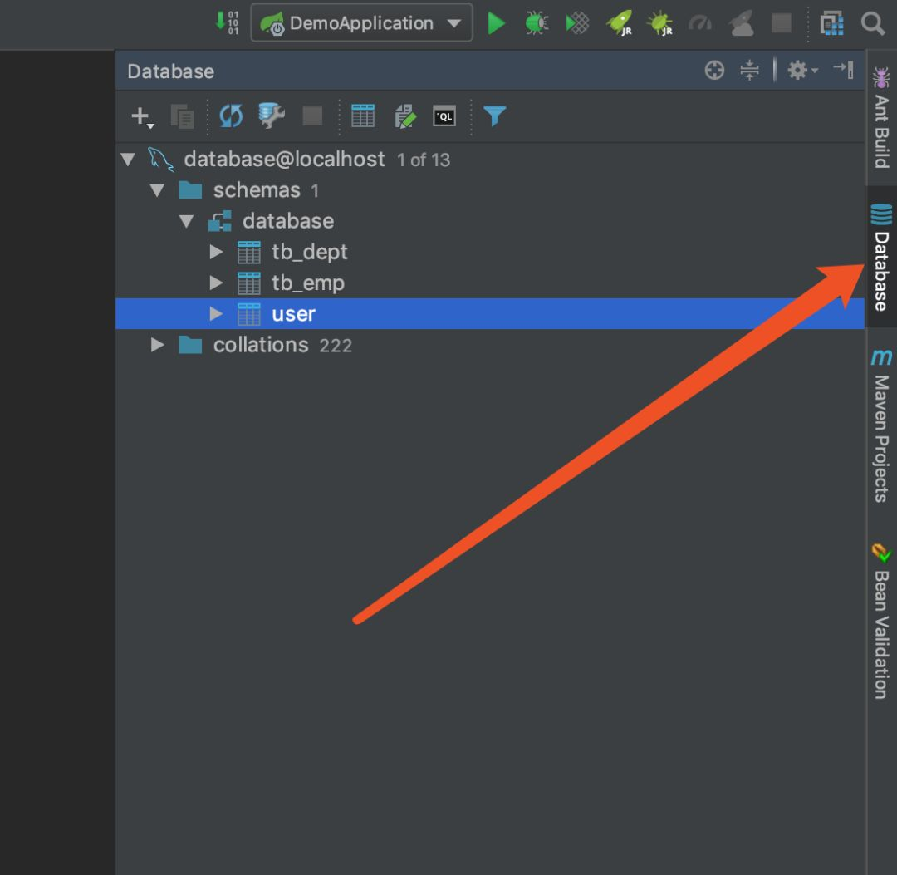
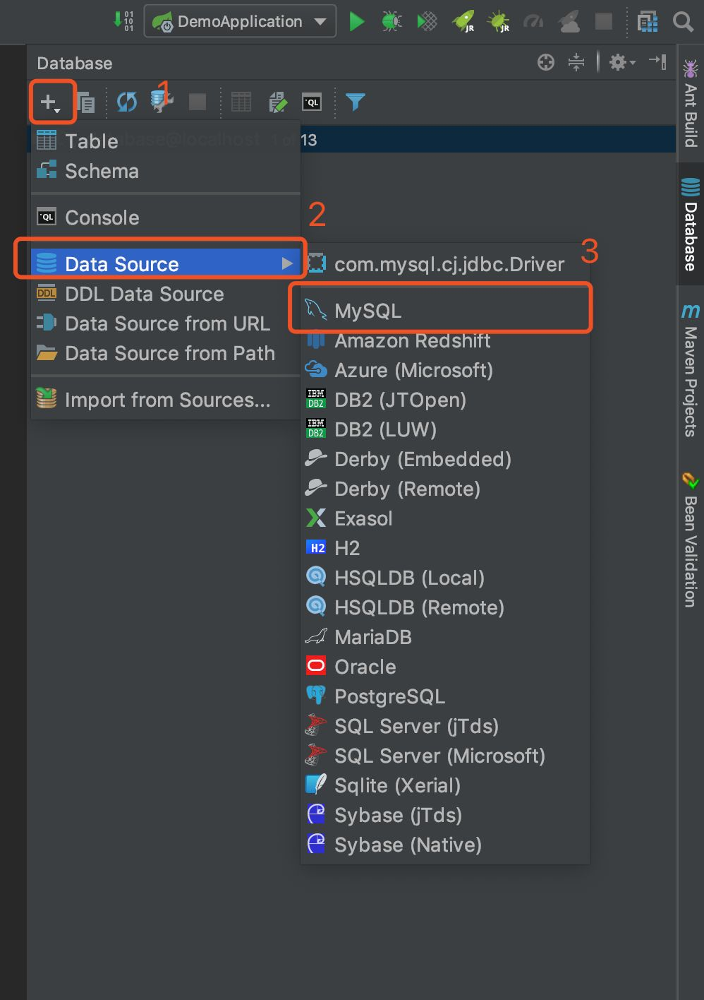
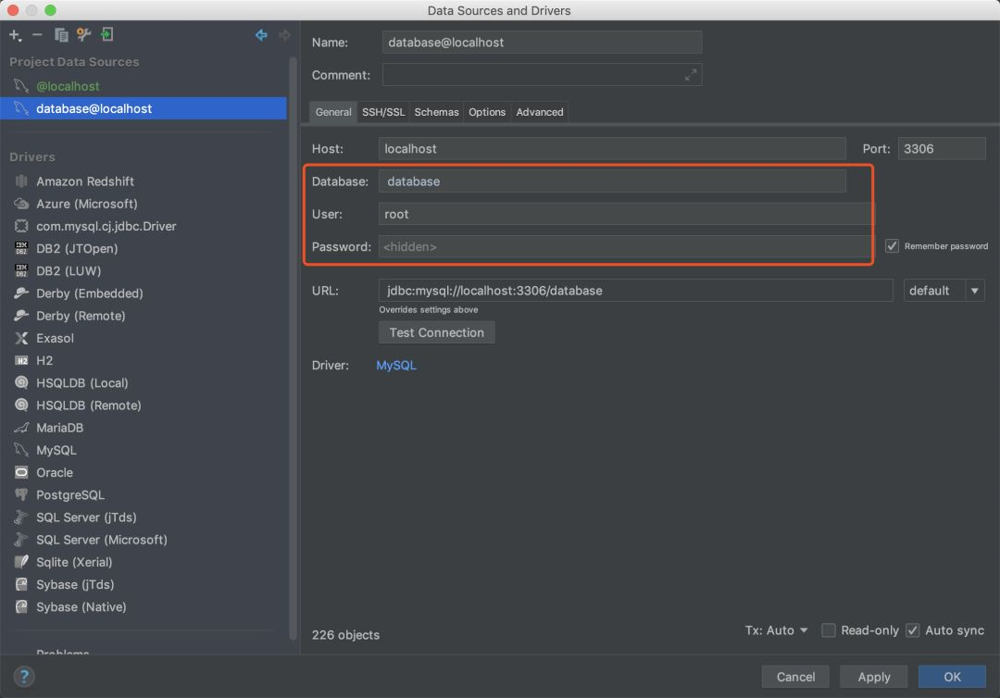
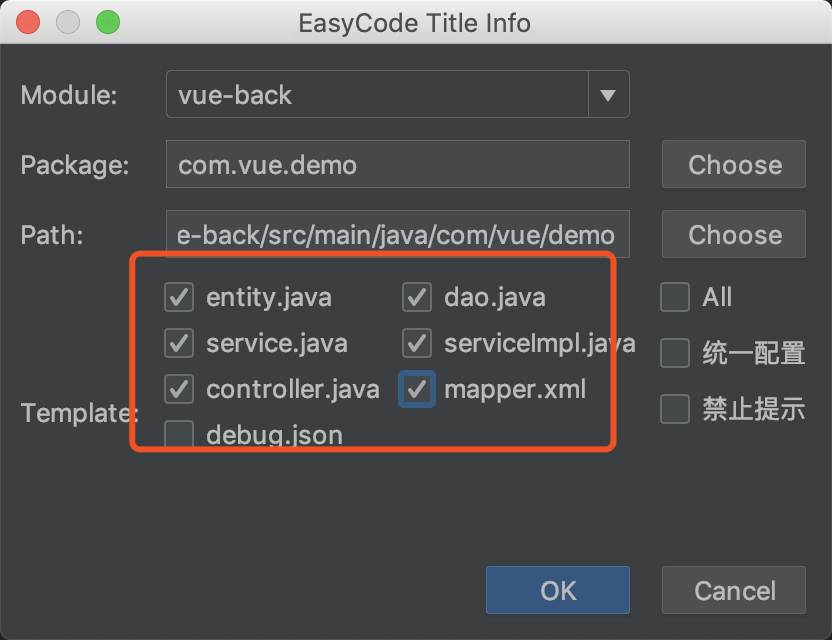
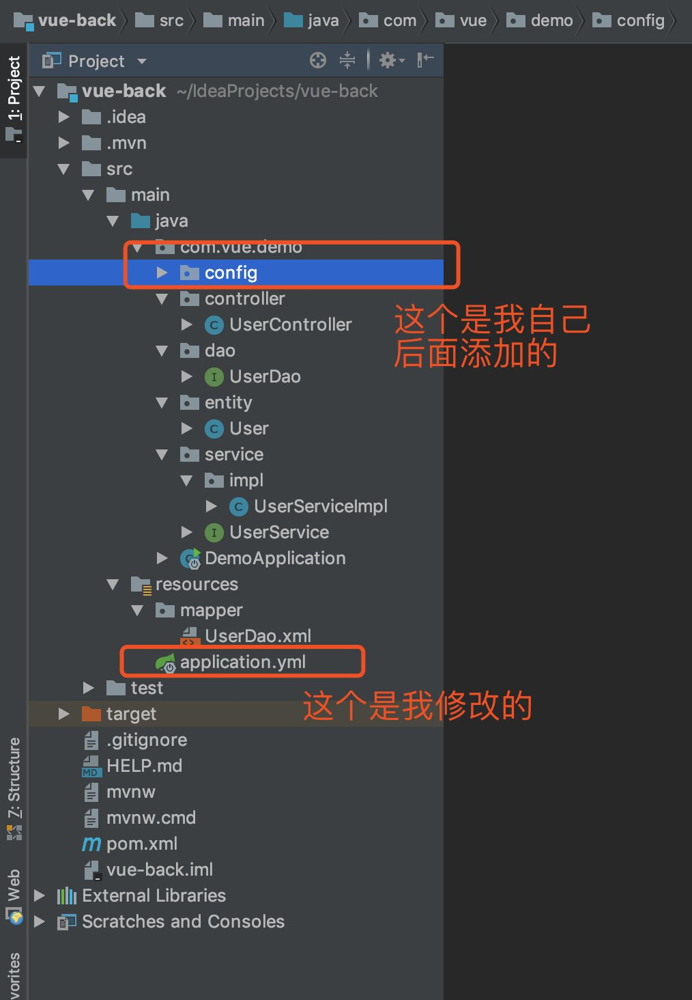
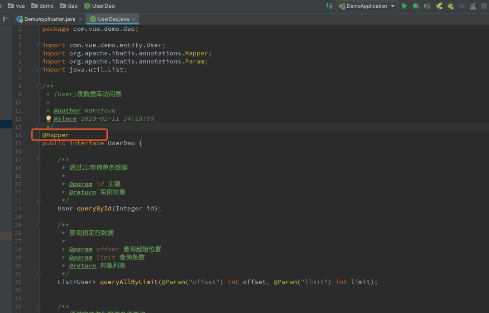
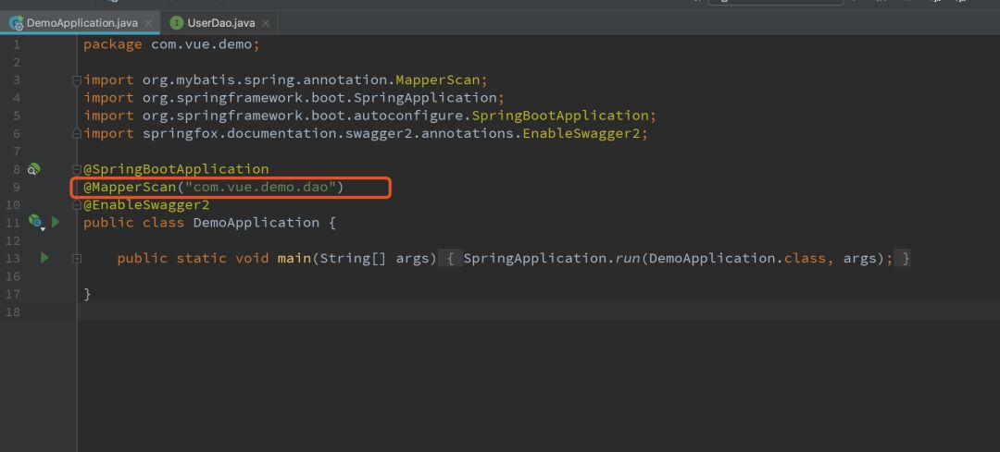
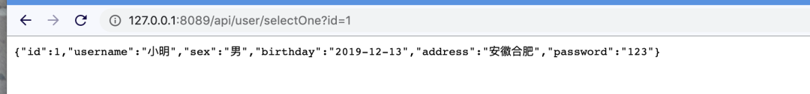
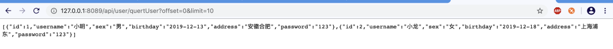

# idea SpringBoot实例
spring主分支
****
# 目录
* [使用SpringInitializr创建SpringBoot项目](#使用SpringInitializr创建SpringBoot项目) 
* [使用EasyCode生成代码](#使用EasyCode生成代码) 
****
## 使用SpringInitializr创建SpringBoot项目
------
###  1、File→New→Project 


###  2、选择Spring Initializr，选择JDK版本→Next  


###  3、填写项目名称，java版本，其他描述信息→Next     


###  4、选择web依赖→Next   


###  5、选择项目存放路径→Fiinsh


###  6、This Window在当前打开项目，New Window新开窗口打开项目，选其一


###  7、右下角弹出窗口选着Enable Auto-import自动引入依赖，进度条加载完成SpringBoot项目的创建


## 使用EasyCode生成代码

Easycode是idea的一个插件，可以直接对数据的表生成entity,controller,service,dao,mapper,无需任何编码，简单而强大。

### 1、安装(EasyCode)



我这里的话是已经那装好了。

- 建议大家在安装一个插件，叫做Lombok。Lombok能通过注解的方式，在编译时自动为属性生成构造器、getter/setter、equals、hashcode、toString方法。出现的神奇就是在源码中没有getter和setter方法，但是在编译生成的字节码文件中有getter和setter方法。

### 2、建立数据库

```mysql
-- ----------------------------
-- Table structure for user
-- ----------------------------
DROP TABLE IF EXISTS `user`;
CREATE TABLE `user` (
  `id` int(11) NOT NULL,
  `username` varchar(20) DEFAULTNULL,
  `sex` varchar(6) DEFAULTNULL,
  `birthday` date DEFAULTNULL,
  `address` varchar(20) DEFAULTNULL,
  `password` varchar(20) DEFAULTNULL,
  PRIMARY KEY (`id`)
) ENGINE=InnoDB DEFAULT CHARSET=utf8;
SET FOREIGN_KEY_CHECKS = 1;
```

### 3、在IDEA配置连接数据库

- 在这个之前，新建一个Springboot项目，这个应该是比较简单的。
- 建好SpringBoot项目之后，如下图所示，找到这个Database



- 按照如下图所示进行操作：



- 然后填写数据库名字，用户名，密码。点击OK即可。这样的话，IDEA连接数据库就完事了。



### 4、开始生成代码

- 在这个里面找到你想生成的表，然后右键，就会出现如下所示的截面。


- 点击1所示的位置，选择你要将生成的代码放入哪个文件夹中，选择完以后点击OK即可。

[ ](https://mp.weixin.qq.com/s?__biz=MzUzMTA2NTU2Ng==&mid=2247487551&idx=1&sn=18f64ba49f3f0f9d8be9d1fdef8857d9&scene=21#wechat_redirect)

- 勾选你需要生成的代码，点击OK。



- 这样的话就完成了代码的生成了，生成的代码如下图所示：



### 5、pom.xml

```xml
<dependency>
  <groupId>org.springframework.boot</groupId>
  <artifactId>spring-boot-starter</artifactId>
</dependency>

<dependency>
  <groupId>org.springframework.boot</groupId>
  <artifactId>spring-boot-starter-web</artifactId>
</dependency>

<dependency>
  <groupId>org.projectlombok</groupId>
  <artifactId>lombok</artifactId>
  <optional>true</optional>
</dependency>

<!--热部署-->
<dependency>
  <groupId>org.springframework.boot</groupId>
  <artifactId>spring-boot-devtools</artifactId>
<optional>true</optional><!-- 这个需要为 true 热部署才有效 -->
</dependency>

<!--mybatis-->
<dependency>
  <groupId>org.mybatis.spring.boot</groupId>
  <artifactId>mybatis-spring-boot-starter</artifactId>
  <version>1.3.2</version>
</dependency>

<!-- mysql -->
<dependency>
  <groupId>mysql</groupId>
  <artifactId>mysql-connector-java</artifactId>
  <version>5.1.47</version>
</dependency>

<!--阿里巴巴连接池-->
<dependency>
  <groupId>com.alibaba</groupId>
  <artifactId>druid</artifactId>
  <version>1.0.9</version>
</dependency>
```

### 6、Application.yml

```yaml
server:
  port: 8089
spring:
  datasource:
    url: jdbc:mysql://127.0.0.1:3306/database?useUnicode=true&characterEncoding=UTF-8
    username: root
    password: 123456
    type: com.alibaba.druid.pool.DruidDataSource
    driver-class-name: com.mysql.jdbc.Driver

mybatis:
  mapper-locations: classpath:/mapper/*Dao.xml
  typeAliasesPackage: com.vue.demo.entity
```

### 7、启动项目

在启动项目之前，我们需要先修改两个地方。

- 在dao层加上@mapper注解 



- 在启动类里面加上@MapperScan("com.vue.demo.dao")注解。



- 启动项目


- 测试一下



