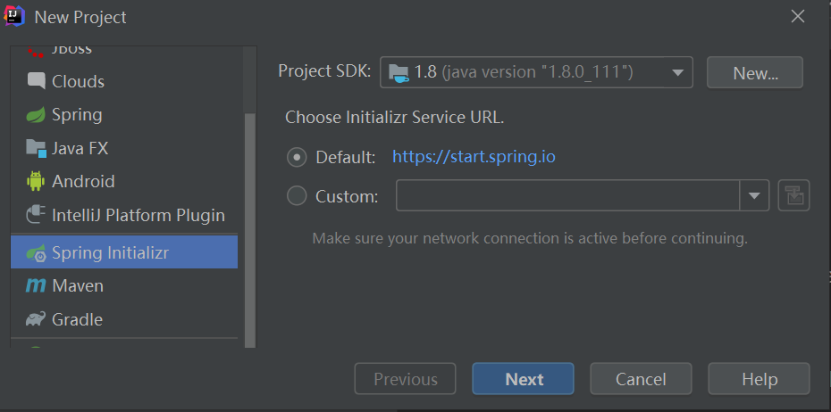
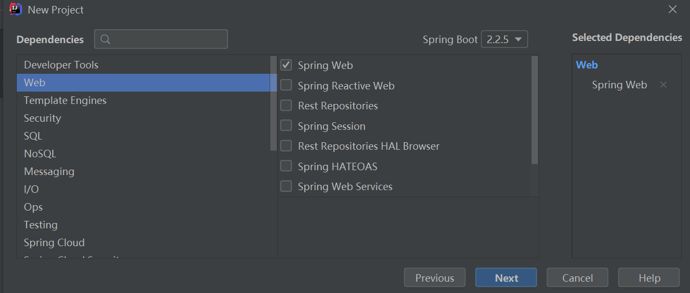
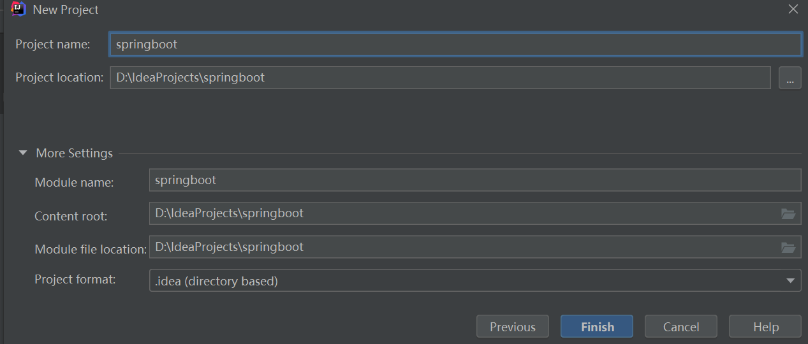
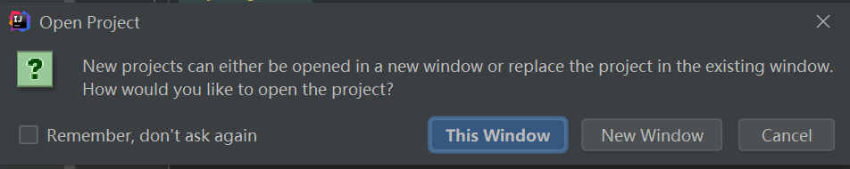
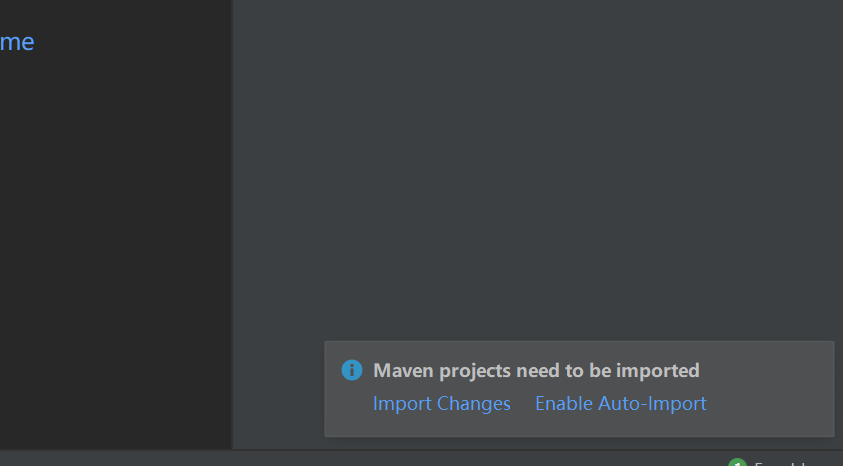

# idea SpringBoot实例
****
## 目录
* [使用SpringInitializr创建SpringBoot项目](#使用SpringInitializr创建SpringBoot项目) 
****
使用SpringInitializr创建SpringBoot项目
------
1、File→New→Project 

2、选择Spring Initializr，选择JDK版本→Next  

3、填写项目名称，java版本，其他描述信息→Next     

4、选择web依赖→Next   

5、选择项目存放路径→Fiinsh

6、This Window在当前打开项目，New Window新开窗口打开项目，选其一

7、右下角弹出窗口选着Enable Auto-import自动引入依赖，进度条加载完成SpringBoot项目的创建

