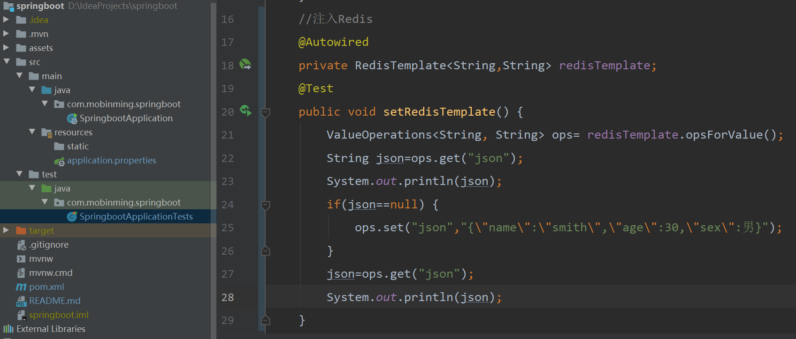

# idea SpringBoot实例
使用SpringInitializr创建SpringBoot项目
****
## 目录
* [使用SpringInitializr创建SpringBoot项目](#使用SpringInitializr创建SpringBoot项目) 
* [整合Mybatis-使用MybatisGenerator自动生成dao-entity-mapper](#整合Mybatis-使用MybatisGenerator自动生成dao-entity-mapper) 
****
使用SpringInitializr创建SpringBoot项目
------
1、File→New→Project 


2、选择Spring Initializr，选择JDK版本→Next  


3、填写项目名称，java版本，其他描述信息→Next     


4、选择web依赖→Next   


5、选择项目存放路径→Fiinsh


6、This Window在当前打开项目，New Window新开窗口打开项目，选其一


7、右下角弹出窗口选着Enable Auto-import自动引入依赖，进度条加载完成SpringBoot项目的创建


****
整合Mybatis-使用MybatisGenerator自动生成dao-entity-mapper
------

1、 添加所需依赖，打开项目的pom.xml文件添加  

```xml
		<!--添加mysql依赖-->
        <dependency>
            <groupId>mysql</groupId>
            <artifactId>mysql-connector-java</artifactId>
            <version>5.1.48</version>
        </dependency>
        <!--添加mybatis依赖-->
        <dependency>
            <groupId>org.mybatis.spring.boot</groupId>
            <artifactId>mybatis-spring-boot-starter</artifactId>
            <version>2.1.1</version>
        </dependency>
```

2、mybatis-generator-maven插件的配置，打开项目的pom.xml文件添加  

```xml
			<!--mybatis-generator-maven插件的配置-->
            <plugin>
                <groupId>org.mybatis.generator</groupId>
                <artifactId>mybatis-generator-maven-plugin</artifactId>
                <configuration>
                    <verbose>true</verbose>
                    <overwrite>true</overwrite>
                </configuration>
            </plugin>
```

3、在项目目录下添加dao、entity包，在resources下添加mapper包存放映射文件。  



4.、application配置（两个格式选其一）  

​	application.yml：

```yaml
spring:
  #jdbc配置
  datasource:
    url: jdbc:mysql://localhost:3306/springboot-demo-db?useUnicode=true&characterEncoding=utf8
    username: root
    password: 123456
    driver-class-name: com.mysql.jdbc.Driver
#mybatis配置
mybatis:
  #映射文件路径
  mapper-locations: classpath:mapper/*.xml
  #模型所在的保命
  type-aliases-package: com.mobinming.springboot.entity

```

application.properties：  

```properties
#jdbc配置
spring.datasource.url=jdbc:mysql://localhost:3306/springboot-demo-db?useUnicode=true&characterEncoding=utf8:
spring.datasource.username=root
spring.datasource.password=123456
spring.datasource.driver-class-name=com.mysql.jdbc.Driver
#mybatis配置
#映射文件路径
mybatis.mapper-locations=classpath:mapper/*.xml
#模型所在的保命
mybatis.type-aliases-package=com.mobinming.springboot.entity

```

5. generatorConfig.xml配置  
在resources文件下创建generatorConfig.xml文件，配置如下（选其一）：

generatorConfig.xml（生成xml方式）：

```xml
<?xml version="1.0" encoding="UTF-8"?>
<!DOCTYPE generatorConfiguration PUBLIC "-//mybatis.org//DTD MyBatis Generator Configuration 1.0//EN"
        "http://mybatis.org/dtd/mybatis-generator-config_1_0.dtd">
<!-- 配置生成器 -->
<generatorConfiguration>

    <!--classPathEntry:数据库的JDBC驱动,换成你自己的驱动位置 可选 -->
    <classPathEntry location="E:/exeCache/apache-maven-3.6.3/maven-repository/mysql/mysql-connector-java/5.1.48/mysql-connector-java-5.1.48.jar"/>

    <!-- 一个数据库一个context,defaultModelType="flat" 大数据字段，不分表 -->
    <context id="MysqlTables" targetRuntime="MyBatis3Simple" defaultModelType="flat">

        <!-- 自动识别数据库关键字，默认false，如果设置为true，根据SqlReservedWords中定义的关键字列表；一般保留默认值，遇到数据库关键字（Java关键字），使用columnOverride覆盖 -->
        <property name="autoDelimitKeywords" value="true"/>

        <!-- 生成的Java文件的编码 -->
        <property name="javaFileEncoding" value="utf-8"/>

        <!-- beginningDelimiter和endingDelimiter：指明数据库的用于标记数据库对象名的符号，比如ORACLE就是双引号，MYSQL默认是`反引号； -->
        <property name="beginningDelimiter" value="`"/>
        <property name="endingDelimiter" value="`"/>

        <!-- 格式化java代码 -->
        <property name="javaFormatter" value="org.mybatis.generator.api.dom.DefaultJavaFormatter"/>

        <!-- 格式化XML代码 -->
        <property name="xmlFormatter" value="org.mybatis.generator.api.dom.DefaultXmlFormatter"/>
        <plugin type="org.mybatis.generator.plugins.SerializablePlugin"/>
        <plugin type="org.mybatis.generator.plugins.ToStringPlugin"/>

        <!-- 注释 -->
        <commentGenerator>
            <property name="suppressAllComments" value="true"/><!-- 是否取消注释 -->
            <property name="suppressDate" value="false"/> <!-- 是否生成注释代时间戳-->
        </commentGenerator>

        <!-- jdbc连接-->
        <jdbcConnection driverClass="com.mysql.jdbc.Driver"
                        connectionURL="jdbc:mysql://localhost:3306/springboot-demo-db?serverTimezone=UTC" userId="root"
                        password="123456"/>

        <!-- 类型转换 -->
        <javaTypeResolver>
            <!-- 是否使用bigDecimal， false可自动转化以下类型（Long, Integer, Short, etc.） -->
            <property name="forceBigDecimals" value="false"/>
        </javaTypeResolver>

        <!-- 生成实体类地址 -->
        <javaModelGenerator targetPackage="com.mobinming.springboot.entity" targetProject="src/main/java">
            <!-- 是否让schema作为包的后缀 -->
            <property name="enableSubPackages" value="false"/>
            <!-- 从数据库返回的值去掉前后空格 -->
            <property name="trimStrings" value="true"/>
        </javaModelGenerator>

        <!-- 生成map.xml文件存放地址 -->
        <sqlMapGenerator targetPackage="mapper" targetProject="src/main/resources">
            <property name="enableSubPackages" value="false"/>
        </sqlMapGenerator>

        <!-- 生成接口dao -->
        <javaClientGenerator targetPackage="com.mobinming.springboot.dao" targetProject="src/main/java" type="XMLMAPPER">
            <property name="enableSubPackages" value="false"/>
        </javaClientGenerator>

        <!-- table可以有多个,每个数据库中的表都可以写一个table，tableName表示要匹配的数据库表,也可以在tableName属性中通过使用%通配符来匹配所有数据库表,只有匹配的表才会自动生成文件 enableSelectByPrimaryKey相应的配置表示是否生成相应的接口 -->
        <table tableName="users" enableCountByExample="false" enableUpdateByExample="false"
               enableDeleteByExample="false" enableSelectByExample="false" selectByExampleQueryId="false"
               enableSelectByPrimaryKey="true" enableUpdateByPrimaryKey="true"
               enableDeleteByPrimaryKey="true">
            <property name="useActualColumnNames" value="true"/>
        </table>

    </context>
</generatorConfiguration>

```

generatorConfig.xml（生成非xml方式）：  

```xml
<?xml version="1.0" encoding="UTF-8"?>
<!DOCTYPE generatorConfiguration
        PUBLIC "-//mybatis.org//DTD MyBatis Generator Configuration 1.0//EN"
        "http://mybatis.org/dtd/mybatis-generator-config_1_0.dtd">
<generatorConfiguration>

    <!--指定特定数据库的jdbc驱动jar包的位置 -->
    <classPathEntry location="E:/exeCache/apache-maven-3.6.3/maven-repository/mysql/mysql-connector-java/5.1.48/mysql-connector-java-5.1.48.jar"/>

    <context id="default" targetRuntime="MyBatis3">


        <!-- optional，旨在创建class时，对注释进行控制 -->
        <commentGenerator>
            <property name="suppressDate" value="true" />
            <property name="suppressAllComments" value="true" />
        </commentGenerator>

        <!--jdbc的数据库连接 -->
        <jdbcConnection driverClass="com.mysql.jdbc.Driver"
                        connectionURL="jdbc:mysql://localhost:3306/springboot-demo-db?serverTimezone=UTC"
                        userId="root"
                        password="123456">
            <property name="nullCatalogMeansCurrent" value="true"/>
        </jdbcConnection>


        <!-- 非必需，类型处理器，在数据库类型和java类型之间的转换控制-->
        <javaTypeResolver >
            <property name="forceBigDecimals" value="false" />
        </javaTypeResolver>

        <!-- Model模型生成器,用来生成含有主键key的类，记录类 以及查询Example类
            targetPackage     指定生成的model生成所在的包名
            targetProject     指定在该项目下所在的路径
        -->
        <javaModelGenerator targetPackage="com.mobinming.springboot.entity" targetProject="src/main/java">
            <!-- 是否对model添加 构造函数 -->
            <property name="constructorBased" value="true"/>

            <!-- 是否允许子包，即targetPackage.schemaName.tableName -->
            <property name="enableSubPackages" value="false"/>

            <!-- 建立的Model对象是否 不可改变  即生成的Model对象不会有 setter方法，只有构造方法 -->
            <property name="immutable" value="false"/>

            <!-- 是否对类CHAR类型的列的数据进行trim操作 -->
            <property name="trimStrings" value="true"/>
        </javaModelGenerator>

        <!--Mapper映射文件生成所在的目录 为每一个数据库的表生成对应的SqlMap文件 -->
        <sqlMapGenerator targetPackage="/mapper" targetProject="src/main/resources">
            <property name="enableSubPackages" value="false"/>
        </sqlMapGenerator>


        <!-- 客户端代码，生成易于使用的针对Model对象和XML配置文件 的代码
                type="ANNOTATEDMAPPER",生成Java Model 和基于注解的Mapper对象
                type="MIXEDMAPPER",生成基于注解的Java Model 和相应的Mapper对象
                type="XMLMAPPER",生成SQLMap XML文件和独立的Mapper接口
        -->
        <javaClientGenerator targetPackage="com.mobinming.springboot.dao" targetProject="src/main/java" type="MIXEDMAPPER">
            <property name="enableSubPackages" value=""/>
            <!--
                    定义Maper.java 源代码中的ByExample() 方法的可视性，可选的值有：
                    public;
                    private;
                    protected;
                    default
                    注意：如果 targetRuntime="MyBatis3",此参数被忽略
             -->
            <property name="exampleMethodVisibility" value=""/>
            <!--
                                           方法名计数器
              Important note: this property is ignored if the target runtime is MyBatis3.
             -->
            <property name="methodNameCalculator" value=""/>

            <!--
                                                为生成的接口添加父接口
             -->
<!--            <property name="rootInterface" value=""/>-->

        </javaClientGenerator>
        <table tableName="users" schema="User" domainObjectName="User"
               enableCountByExample="false" enableUpdateByExample="false"
               enableDeleteByExample="false" enableSelectByExample="false"
               selectByExampleQueryId="false">
        </table>

    </context>
</generatorConfiguration>
```

6、在idea中添加一个mybatis generator maven插件启动选项，点击Run，选择Edit Configuration… 点击加号"+"添加，选择maven，填写名称(这里用mybatis generator)，命令行：mybatis-generator:generate -e  

 


7、选择 Mybatis Generator 启动，自动在dao、entity、mapper包下生成代码  

